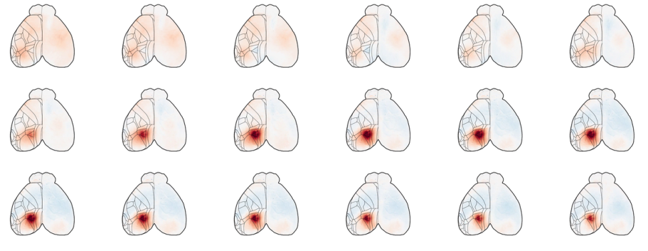

# wfield - tools to analysis widefield data

This is a python package for visualizing and analysing data collected with a widefield macroscope.

#### Use the graphical interface to [launch analysis on NeuroCAAS](usecases.md)

### These tools are for:
  - Motion correction
  - Data reduction
  - Hemodynamic correction
  - Matching to the Allen CCF
  - Visualize raw/reduced data and ROIs

### Use cases and instructions [here](usecases.md)

A [dataset](http://repository.cshl.edu/id/eprint/38599/) that can be used to demo some of the functionality of this repository will be made available in the ``demoRec`` folder.

### File format conventions

  - raw frame data, when stored in binary files (uint16)  
    the filename must end with: `_NCHANNELS_H_W_DTYPE.dat`  
    Example: "frames_2_540_640_uint16.dat" H and W are the dimensions of a single frame.  
    These files can be opened with the command `wfield open_raw <filename>`  

  - denoised/decomposed (locally processed) data are stored as `npy` arrays   
  `U.npy` are the spatial components `(H, W, NCOMPONENTS)`  
  `SVT.npy` are the temporal components `(NCOMPONENTS, NFRAMES)`  
  
  - `SVTcorr.npy` is the hemodynamic corrected temporal components `(NCOMPONENTS, NFRAMES)`
  
  - `info.json` has information about the dataset like the `frame_rate` or the `n_channels`

#### NeuroCAAS results folder

  - `U_atlas.npy` are the spatial components transformed to a common atlas reference frame.    (H, W, NCOMPONENTS)
  - `reduced_spatial.npy` are the spatial components from the PMD `(H*W,NCOMPONENTS)`  
    The H and W of the matrix are in the `config.yaml` file (or use `U_atlas`)
  - `SVTcorr.npy` are the hemodynamic corrected temporal components `(NCOMPONENTS, NFRAMES)` 
  - `reduced_temporal.npy` are the temporal components for the first channel `(NCOMPONENTS, NFRAMES)
  - LocaNMF returns a matlab file with components in spatial components in the `A` variable and temporal components in the `C` variable.

### Installation (from pip)

``pip install wfield``

### Installation (using Anaconda)

To install start by getting [Anaconda](https://www.anaconda.com/distribution/#download-section) or [Miniconda](https://docs.conda.io/en/latest/miniconda.html). Install also [git](https://git-scm.com/book/en/v2/Getting-Started-Installing-Git). Run the following commands from a terminal window (Anaconda prompt or git Bash on Windows, the Mac OS terminal). Check the notes below for common issues.

1. Go to the folder where you want to install and clone the repository: ``git clone https://github.com/jcouto/wfield.git``. This creates a directory; go inside that directory: ``cd wfield``. Alternatively you can download the repository as a [zip file] (https://github.com/churchlandlab/wfield/archive/master.zip).

2. Use anaconda to install all dependencies: ``conda env create -f env.yml`` the file env.yml is inside the ``wfield`` directory.

3. Enter the environment ``conda activate wfield`` and install wfield using the command ``python setup.py install`` followed by ``python setup.py references``

4. You will need to run `conda activate wfield` to activate the environment before running the software every time you start a terminal.

5. You are all set.   Type ``wfield -h`` to see the available commands.   Go here for [instructions](https://github.com/jcouto/wfield/tree/master/usecases.md) on how to use NeuroCAAS.

*Note:* Some reference files used to match to the Allen Common Coordinate Framework are copied from the folder [references](https://github.com/jcouto/wfield/tree/master/references) to ``$HOME/.wfield`` during installation. 

*Note for Mac users:*

   - ``git`` when you try the instructions you will be asked to install git, if that fails you can run ``conda install git`` to install using anaconda. 

*Note for Windows users:*

   - Get a terminal like [git bash](https://git-scm.com/downloads) [optional]  
   Run ``conda init bash`` to activate conda on ``git bash``
   - When you install Anaconda,  set the option to install as system python (this makes that it is visible from the terminal without having to run the Anaconda Prompt).

*Note for developers:* In some cases you may want to make changes to the software, if you need this run ``python setup.py develop`` (you can not move the folder after this - the installation will point to that directory).

The software was tested on Windows, Linux and MacOS Catalina. Installation takes less than 5 minutes on a standard computer with fast access to internet and a previous anaconda installation.

### Tutorial

Instructions to use with NeuroCAAS [here](https://github.com/jcouto/wfield/tree/master/usecases.md).
 

There is a command-line inteface to run computations from the command line. Do `wfield -h` to learn more.   

Notebook examples are [here](https://github.com/jcouto/wfield/tree/master/notebooks).

Look at [this one](https://github.com/jcouto/wfield/tree/master/notebooks/tutorial_example_warping_stack_ROIs.ipynb) to load decomposed data and extract ROIs. 
 

Copyright (C) 2020 Joao Couto - jpcouto@gmail.com

This program is free software: you can redistribute it and/or modify
it under the terms of the GNU General Public License as published by
the Free Software Foundation, either version 3 of the License, or
(at your option) any later version.

This program is distributed in the hope that it will be useful,
but WITHOUT ANY WARRANTY; without even the implied warranty of
MERCHANTABILITY or FITNESS FOR A PARTICULAR PURPOSE.  See the
GNU General Public License for more details.

You should have received a copy of the GNU General Public License
along with this program.  If not, see <http://www.gnu.org/licenses/>.
